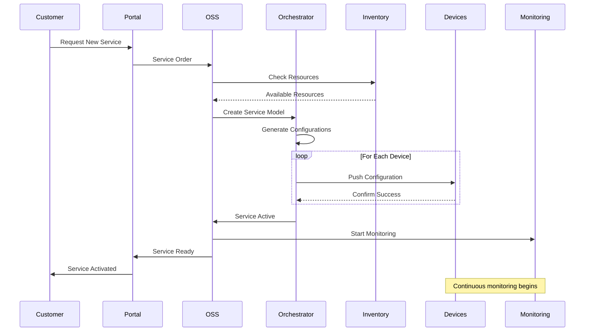
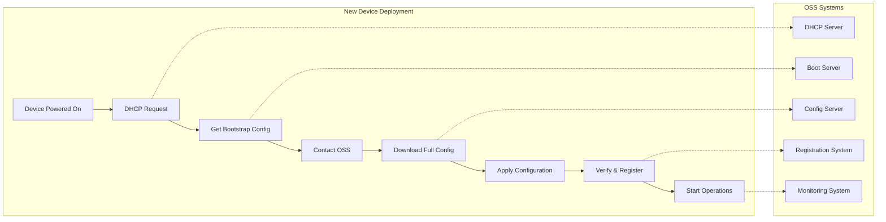
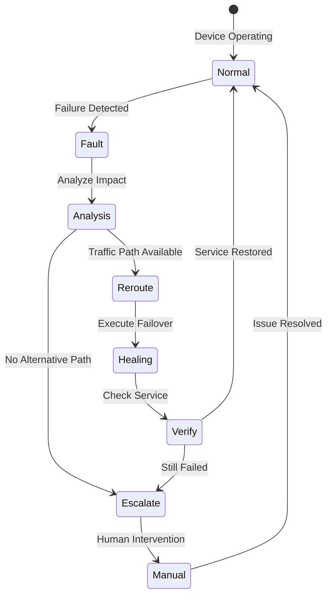

# Automation Workflow Architecture

## Service Provisioning Automation Flow

```mermaid
sequenceDiagram
    participant Customer
    participant Portal
    participant OSS
    participant Orchestrator
    participant Inventory
    participant Devices
    participant Monitoring
    
    Customer->>Portal: Request New Service
    Portal->>OSS: Service Order
    OSS->>Inventory: Check Resources
    Inventory-->>OSS: Available Resources
    
    OSS->>Orchestrator: Create Service Model
    Orchestrator->>Orchestrator: Generate Configurations
    
    loop For Each Device
        Orchestrator->>Devices: Push Configuration
        Devices-->>Orchestrator: Confirm Success
    end
    
    Orchestrator->>OSS: Service Active
    OSS->>Monitoring: Start Monitoring
    OSS->>Portal: Service Ready
    Portal->>Customer: Service Activated
    
    Note over Monitoring,Devices: Continuous monitoring begins
```

## Zero-Touch Provisioning Flow

```mermaid
graph LR
    subgraph "New Device Deployment"
        A[Device Powered On] --> B[DHCP Request]
        B --> C[Get Bootstrap Config]
        C --> D[Contact OSS]
        D --> E[Download Full Config]
        E --> F[Apply Configuration]
        F --> G[Verify & Register]
        G --> H[Start Operations]
    end
    
    subgraph "OSS Systems"
        DHCP[DHCP Server]
        BOOT[Boot Server]
        CONFIG[Config Server]
        REG[Registration System]
        MON[Monitoring System]
    end
    
    B -.-> DHCP
    C -.-> BOOT
    E -.-> CONFIG
    G -.-> REG
    H -.-> MON
```

## Automated Fault Recovery

```mermaid
stateDiagram-v2
    [*] --> Normal: Device Operating
    Normal --> Fault: Failure Detected
    Fault --> Analysis: Analyze Impact
    Analysis --> Reroute: Traffic Path Available
    Analysis --> Escalate: No Alternative Path
    Reroute --> Healing: Execute Failover
    Healing --> Verify: Check Service
    Verify --> Normal: Service Restored
    Verify --> Escalate: Still Failed
    Escalate --> Manual: Human Intervention
    Manual --> Normal: Issue Resolved
```
