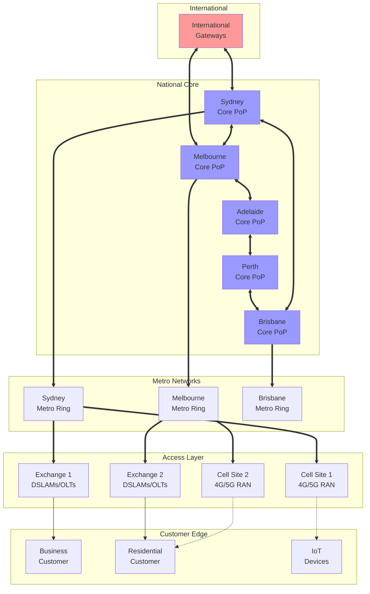

# Telstra Network Topology Overview

## High-Level Network Architecture

## Network Layers

### 1. International Layer
- Submarine cable landings
- International peering points
- Global content delivery networks

### 2. National Core
- High-capacity optical backbone
- Core IP/MPLS routers
- Inter-capital city links

### 3. Metro Networks
- City-wide fiber rings
- Metro Ethernet services
- Mobile backhaul networks

### 4. Access Layer
- Local exchanges
- Cell tower sites
- Street cabinets
- Distribution networks

### 5. Customer Edge
- Business premises
- Residential connections
- IoT and M2M devices
