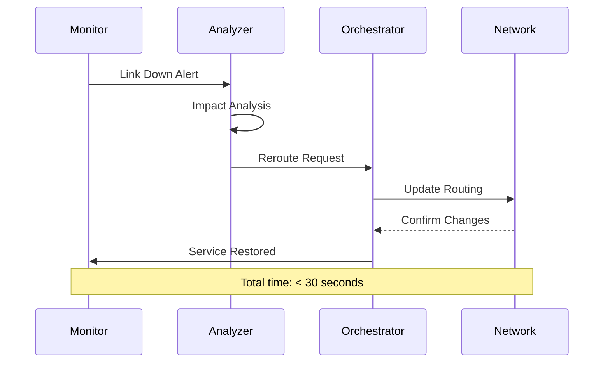

# Automation Use Cases

## Overview
These use cases demonstrate the practical benefits of Telstra's network automation capabilities.

## 1. Zero-Touch Provisioning

### Description
New network devices automatically configure themselves upon connection to the network.

### Process Flow
1. Device powered on and connected to network
2. DHCP assigns management IP
3. Device contacts provisioning server
4. Base configuration downloaded and applied
5. Device registers with OSS
6. Monitoring automatically enabled

### Benefits
- Deployment time: 4 hours → 15 minutes
- Zero manual configuration errors
- Consistent configurations across fleet

## 2. Bulk Software Upgrades

### Description
Automated rollout of software updates across thousands of devices.

### Implementation

```mermaid
gantt
    title Automated Software Upgrade Timeline
    dateFormat  HH:mm
    section Planning
    Identify Devices     :done, 00:00, 30m
    Download Software    :done, 00:30, 1h
    section Execution
    Backup Configs      :active, 01:30, 30m
    Test Upgrade        :02:00, 1h
    Production Rollout  :03:00, 4h
    section Validation
    Verify Success      :07:00, 30m
    Generate Report     :07:30, 30m
```


### Results
- 500 routers upgraded in one maintenance window
- 95% success rate on first attempt
- Automatic rollback for failures

## 3. Dynamic Service Provisioning

### Description
Customer-initiated service changes executed automatically.

### Example: Bandwidth on Demand
1. Customer requests bandwidth increase via portal
2. System checks available capacity
3. Configuration changes generated
4. Changes pushed to relevant devices
5. Service activated within minutes
6. Billing automatically updated

### Metrics
- Service activation: 5 days → 5 minutes
- Customer satisfaction: 40% improvement
- Operational cost: 60% reduction

## 4. Self-Healing Networks

### Description
Automatic detection and resolution of network issues.

### Scenarios Handled
- Link failures with automatic rerouting
- Device failures with service migration
- Performance degradation with auto-tuning
- Security threats with immediate response

### Example Response


## 5. Compliance Automation

### Description
Continuous validation and enforcement of security policies.

### Capabilities
- Daily configuration audits
- Automatic remediation of violations
- Real-time compliance reporting
- Regulatory requirement tracking

### Example Checks
- Password complexity enforcement
- Unused port shutdown
- ACL consistency
- Encryption verification
- Logging compliance

## 6. Predictive Maintenance

### Description
ML-driven prediction of device failures before they occur.

### Data Sources
- Performance metrics
- Environmental sensors
- Historical failure data
- Vendor advisories

### Actions
- Proactive device replacement
- Capacity augmentation
- Preventive maintenance scheduling
- Spare parts optimization

## 7. Customer Self-Service

### Description
API-driven customer control of network services.

### Available Functions
- Bandwidth adjustment
- VLAN provisioning
- Firewall rule management
- Performance monitoring
- Service catalog ordering

### Integration Example
```python
import requests

# Customer adjusts bandwidth
response = requests.post(
    "https://api.telstra.com/network/v1/services/my-service/bandwidth",
    headers={"Authorization": f"Bearer {token}"},
    json={"bandwidth": "2000", "duration": "4hours"}
)

print(f"Service updated: {response.json()}")
```

## 8. Multi-Domain Orchestration

### Description
Coordinated automation across IP, optical, and mobile domains.

### Example: End-to-End Service
1. Customer orders mobile backhaul upgrade
2. Orchestrator coordinates:
   - Optical wavelength provisioning
   - IP routing configuration
   - RAN parameter adjustment
   - QoS policy updates
3. Service validated end-to-end
4. Monitoring enabled across domains

## 9. Automated Testing

### Description
Continuous validation of network services and configurations.

### Test Categories
- Service availability
- Performance benchmarks
- Security compliance
- Disaster recovery
- Configuration consistency

### Automation Benefits
- 24/7 testing coverage
- Immediate issue detection
- Consistent test execution
- Comprehensive reporting

## 10. Capacity Planning

### Description
AI-driven prediction and automated response to capacity needs.

### Process
1. Continuous traffic analysis
2. Growth trend identification
3. Capacity threshold monitoring
4. Automated augmentation triggers
5. Procurement integration

### Results
- Proactive capacity management
- Eliminated emergency augments
- Optimized capital expenditure
- Improved service quality
