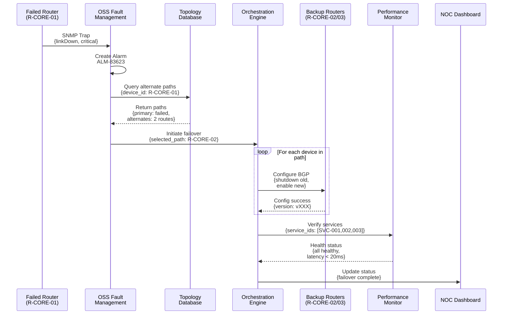
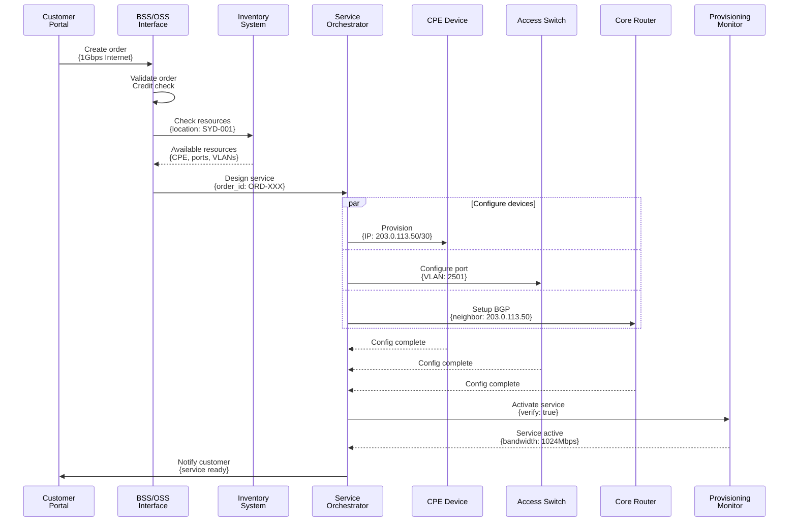
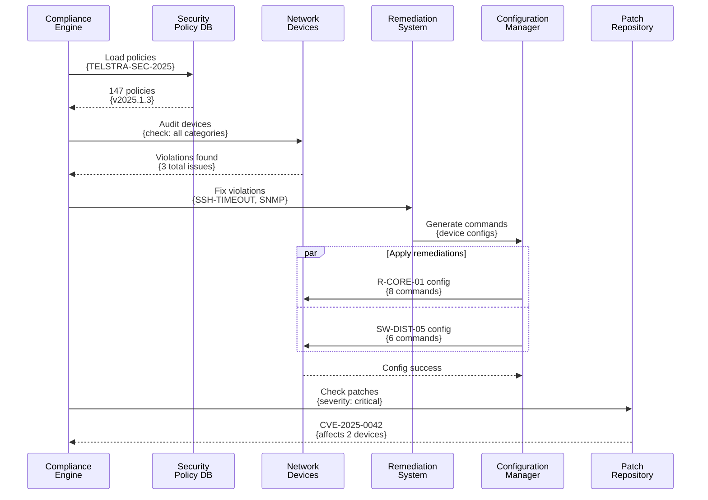
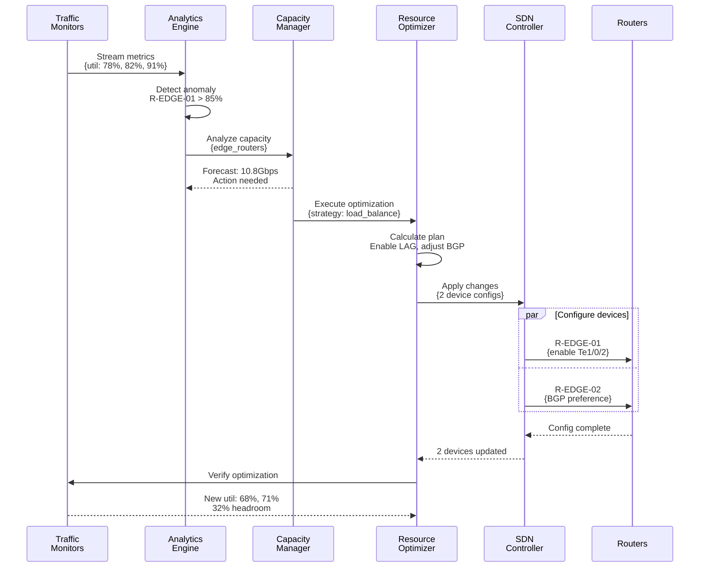

# Control Flow for OT Automation Use Cases

## Overview
This document details the control flow, API interactions, and data exchanges for each OT automation use case, including parameters passed and responses received.

## 1. Automated Network Failover

### Control Flow


### Data Flow Details

#### 1. SNMP Trap (Router → Fault Management)
```json
{
  "trap_type": "linkDown",
  "severity": "critical",
  "interface": "GigabitEthernet0/0/1",
  "status": "down",
  "timestamp": "2025-07-24T14:25:28+10:00"
}
```

#### 2. Alarm Response (Fault Management)
```json
{
  "alarm_id": "ALM-83623",
  "device": "R-CORE-01",
  "status": "acknowledged",
  "correlation_id": "CORR-6314"
}
```

#### 3. Path Calculation (Topology Database)
```json
{
  "primary_path": {
    "route": ["R-CORE-01", "R-DIST-02", "R-ACCESS-05"],
    "status": "failed"
  },
  "alternate_paths": [
    {
      "route": ["R-CORE-02", "R-DIST-03", "R-ACCESS-05"],
      "capacity": "10Gbps",
      "utilization": "45%"
    }
  ]
}
```

## 2. Rapid Service Provisioning

### Control Flow


### Data Flow Details

#### 1. Order Creation (Customer Portal → BSS)
```json
{
  "order_id": "ORD-20250724-1167",
  "customer_id": "CUST-12345",
  "service_type": "enterprise_internet",
  "bandwidth": "1000Mbps",
  "location": {
    "address": "123 Business Park, Sydney NSW",
    "coordinates": {"lat": -33.8688, "lng": 151.2093}
  }
}
```

#### 2. Resource Allocation (Inventory System)
```json
{
  "available_resources": {
    "cpe": {
      "model": "CISCO-ISR-4451",
      "serial": "FCZ2048B0VK"
    },
    "access_switch": {
      "device": "SW-ACCESS-12",
      "port": "Gi1/0/24",
      "vlan": 2501
    },
    "core_router": {
      "device": "R-CORE-02",
      "interface": "Gi0/2/0.2501"
    }
  }
}
```

## 3. Predictive Maintenance

### Control Flow
```mermaid
sequenceDiagram
    participant OPT as Optical Nodes<br/>(OPT-NODE-07/08/09)
    participant PDB as Performance<br/>Database
    participant AI as AI/ML<br/>Engine
    participant MS as Maintenance<br/>Scheduler
    participant OP as Orchestration<br/>Platform
    participant WO as Work Order<br/>System

    loop Every 5 seconds
        OPT->>PDB: Stream telemetry<br/>{power, temp, errors}
    end
    
    PDB->>AI: Analyze patterns<br/>{device_ids: [07,08,09]}
    AI->>AI: Run ML models<br/>Predict failures
    AI-->>PDB: Predictions<br/>{OPT-NODE-08: 87% fail}
    
    alt High probability failure
        AI->>MS: Schedule maintenance<br/>{device: OPT-NODE-08}
        MS->>WO: Create work order<br/>{WO-666368}
        MS-->>AI: Scheduled for<br/>2025-07-27
        
        AI->>OP: Apply mitigation<br/>{tx_power: +0.5dB}
        OP->>OPT: Adjust parameters<br/>{FEC: enhanced}
        OPT-->>OP: Adjustments applied<br/>{BER: 2.1e-12}
    end
```

### Data Flow Details

#### 1. Telemetry Stream (Optical Nodes → Performance DB)
```json
{
  "metrics": {
    "optical_power": {
      "rx_power_dbm": -15.43,
      "tx_power_dbm": 1.84,
      "ber": "1.2e-8"
    },
    "temperature_c": 44,
    "uptime_hours": 8147,
    "error_counts": {
      "crc_errors": 52,
      "fec_corrections": 217
    }
  },
  "timestamp": "2025-07-24T14:25:47+10:00"
}
```

#### 2. ML Prediction (AI/ML Engine)
```json
{
  "predictions": [{
    "device_id": "OPT-NODE-08",
    "prediction": "optical_degradation",
    "probability": 0.87,
    "estimated_failure_date": "2025-07-29T14:25:49+10:00",
    "root_cause": "SFP module aging"
  }],
  "confidence_score": 0.92
}
```

## 4. Security Compliance Automation

### Control Flow


### Data Flow Details

#### 1. Audit Results (Network Devices)
```json
{
  "audit_results": [{
    "device": "R-CORE-01",
    "compliant": 142,
    "violations": [
      {"rule": "SSH-TIMEOUT", "current": "3600", "required": "900"},
      {"rule": "SNMP-COMMUNITY", "current": "public", "required": "complex_string"}
    ]
  }]
}
```

#### 2. Remediation Commands (Configuration Manager)
```json
{
  "remediation_plan": {
    "R-CORE-01": [
      "configure terminal",
      "line vty 0 15",
      "exec-timeout 15 0",
      "exit",
      "no snmp-server community public",
      "snmp-server community C0mpl3x$tr1ng2025 RO",
      "write memory"
    ]
  }
}
```

## 5. Dynamic Capacity Management

### Control Flow


### Data Flow Details

#### 1. Traffic Alert (Analytics Engine)
```json
{
  "alerts": [{
    "type": "high_utilization",
    "device": "R-EDGE-01",
    "interface": "Te1/0/1",
    "current_util": 91,
    "threshold": 85,
    "trending": "increasing"
  }]
}
```

#### 2. Optimization Plan (Resource Optimizer)
```json
{
  "optimization_plan": {
    "immediate_actions": [
      {
        "type": "enable_lag_member",
        "device": "R-EDGE-01",
        "interface": "Te1/0/2"
      },
      {
        "type": "adjust_bgp_weights",
        "device": "R-EDGE-02",
        "community": "65001:100"
      }
    ],
    "traffic_shift_pct": 25
  }
}
```

## Common Patterns

### API Response Structure
All API responses follow a consistent pattern:
```json
{
  "status": "success|failed",
  "timestamp": "ISO8601 timestamp",
  "data": {/* specific response data */},
  "errors": [/* if applicable */]
}
```

### Authentication & Authorization
- All API calls include implicit authentication headers (not shown)
- Device access uses TACACS+/RADIUS for centralized auth
- Service accounts have role-based permissions

### Error Handling
Each flow includes rollback capabilities:
- Configuration changes can be reverted
- Failed operations trigger compensating actions
- All changes are logged for audit trail

### Performance Considerations
- Telemetry streaming uses efficient protocols (gRPC/NETCONF)
- Bulk operations are batched for efficiency
- Critical paths have sub-second response requirements