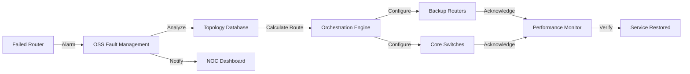
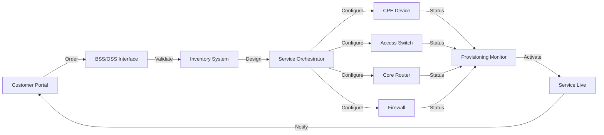
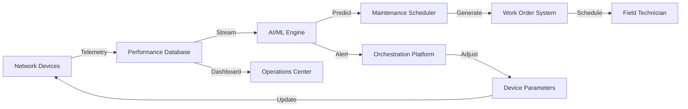
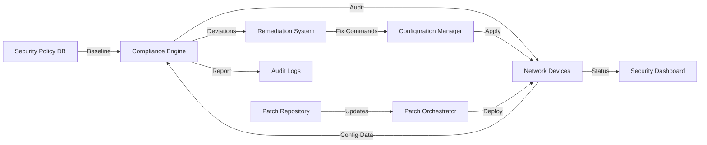
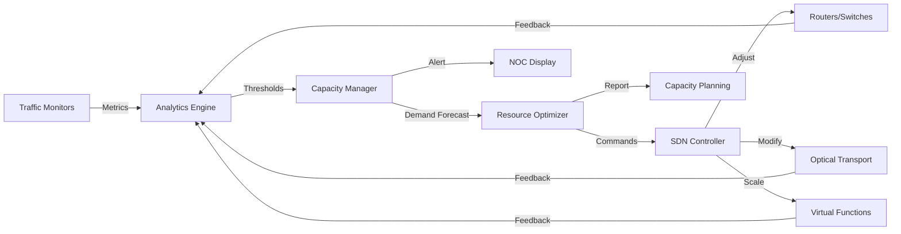

# OT Automation System Use Cases

## Overview
This document outlines five key use cases for a fully implemented OT automation system, including the workflow and components involved in each scenario.

## Use Cases

### 1. Automated Network Failover

**Description:** When a critical network component fails, the system automatically detects the issue and reroutes traffic through backup paths without human intervention, ensuring continuous service availability.

### 2. Rapid Service Provisioning

**Description:** Customer orders a new service online, and the system automatically configures all necessary network elements end-to-end, activating the service within minutes instead of days.

### 3. Predictive Maintenance

**Description:** System continuously analyzes performance metrics from network devices to predict failures before they occur, automatically scheduling maintenance or adjusting parameters to prevent service impact.

### 4. Security Compliance Automation

**Description:** Continuous security audit of all network devices with automatic remediation of configuration deviations and coordinated patch deployment across the infrastructure.

### 5. Dynamic Capacity Management

**Description:** Real-time monitoring of network utilization with automatic capacity adjustments to handle traffic spikes, optimize resource usage, and maintain quality of service.

## Implementation Notes

Each use case leverages multiple OSS/BSS components working in concert:

- **Orchestration Platforms** coordinate actions across domains
- **Inventory Systems** maintain real-time network state
- **Analytics Engines** process telemetry for intelligent decisions
- **Configuration Managers** ensure consistent device settings
- **Monitoring Systems** provide continuous visibility
- **API Gateways** enable integration between components

The success of these automated workflows depends on:
1. Standardized device APIs (NETCONF/RESTCONF)
2. Real-time telemetry collection
3. Accurate network inventory
4. Robust orchestration logic
5. Comprehensive testing and validation

## Technical Architecture

### Core Components

| Component | Function | Key Technologies |
|-----------|----------|------------------|
| Service Orchestrator | End-to-end workflow automation | BPMN, TOSCA, YANG models |
| Configuration Manager | Device configuration management | Ansible, NSO, NETCONF |
| Performance Database | Time-series telemetry storage | InfluxDB, Prometheus |
| Analytics Engine | ML-based predictive analysis | TensorFlow, Apache Spark |
| Inventory System | Real-time network topology | Graph DB, Neo4j |
| Policy Engine | Business rule enforcement | Drools, OPA |

### Integration Patterns

The automation system employs several integration patterns:

- **Event-Driven Architecture:** Components communicate through event streams (Kafka)
- **API-First Design:** RESTful APIs for all inter-component communication
- **Microservices:** Each functional domain deployed as independent services
- **GitOps:** Configuration as code with version control and CI/CD pipelines

## Benefits Summary

### Operational Benefits
- **Reduced MTTR:** From hours to minutes for common failures
- **Elimination of Human Error:** Standardized, tested automation workflows
- **24/7 Autonomous Operation:** No dependency on human availability
- **Proactive vs Reactive:** Issues resolved before customer impact

### Business Benefits
- **Faster Time to Revenue:** Services activated in minutes not weeks
- **Reduced OpEx:** Fewer manual interventions and truck rolls
- **Improved SLAs:** Higher availability and consistent performance
- **Competitive Advantage:** Ability to offer on-demand, API-driven services

### Strategic Benefits
- **Scalability:** Handle network growth without proportional staff increase
- **Innovation Platform:** Foundation for new services (network slicing, edge computing)
- **Data-Driven Insights:** Rich telemetry enables business intelligence
- **Future-Ready:** Prepared for 5G, IoT, and cloud-native architectures

## Conclusion

A fully implemented OT automation system transforms network operations from reactive manual processes to proactive autonomous management. By orchestrating complex workflows across heterogeneous infrastructure, telecommunications providers can achieve unprecedented levels of efficiency, reliability, and agility. The five use cases presented here represent just the beginning of what's possible when network intelligence is combined with comprehensive automation capabilities.